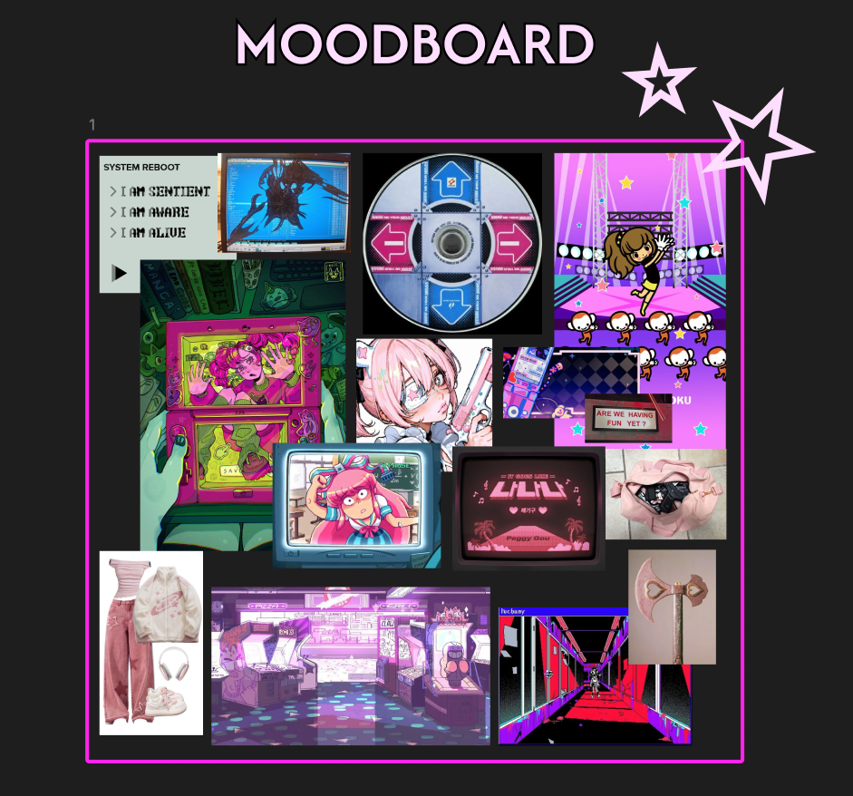

# Concept · El moodboard

Intenta explicar con palabras el aspecto que quieres para tu juego: "oscuro pero con esperanza, un poco steampunk sin pasarse, con colores apagados y algún acento cálido". Cada persona que lea esa frase se imaginará algo distinto. Ahora pon doce imágenes juntas en un tablero y enséñalas. En diez segundos todo el mundo está pensando en lo mismo. Esa es **la función del moodboard**.

## Qué es

Un moodboard es un **tablero de imágenes** que recoge la atmósfera, el estilo y el tono visual de un proyecto. Reúne fotografías, capturas de otros juegos, fotogramas de películas, ilustraciones, texturas, paletas de color y cualquier cosa que transmita la sensación que buscas. Funciona como **un resumen visual de la dirección artística**.

Es **la primera tarea visual después de leer el brief**, antes del primer boceto. Te ahorra horas de trabajo en la dirección equivocada, y a lo largo del proyecto sirve para comprobar si lo que produces sigue encajando: si un asset desentona al ponerlo al lado del moodboard, **probablemente desentone en el juego**.

## Cómo se construye uno útil

La primera regla es **buscar sensaciones antes que soluciones**. Si tu personaje es un caballero cansado, las mejores referencias probablemente no sean otros caballeros de videojuego: pueden ser fotografías de veteranos de guerra, armaduras reales abolladas, la luz de un atardecer de invierno. Si buscas "caballero videojuego", encontrarás los mismos cien caballeros que ha encontrado todo el mundo, y tu diseño se parecerá a todos ellos. Si solo recopilas diseños ya resueltos, acabarás copiándolos.

La segunda es **mezclar tipos de imagen**. Un moodboard con solo capturas de juegos se queda corto. Combina fotografía real (materiales, luz, arquitectura, ropa), arte de otros medios (cine, cómic, ilustración) y muestras de color y textura.

La tercera es **seleccionar**. Un tablero con doscientas imágenes no comunica nada; eso es una carpeta de descargas. Quédate con las que mejor representan la idea y quita las que se contradicen entre sí. **Todas las imágenes tienen que parecer del mismo mundo.**

La cuarta es **organizar**. Agrupa por temas (personajes, entorno, luz, materiales, paleta) para que quien lo mire entienda qué aporta cada zona.

Y la última es tratarlo como un **documento vivo**. El moodboard evoluciona con el proyecto: añades lo que descubres y quitas lo que ya no representa la dirección elegida.

## Tipos de moodboard

En un proyecto rara vez hay uno solo. El **general** recoge la visión global del juego. Los **específicos** se centran en un personaje, una zona o un aspecto concreto, como la iluminación. Y a veces es muy útil un tablero de **lo que no queremos**, que deja claro qué referencias parecidas hay que evitar para que nadie tire hacia ahí. Parece raro, pero ahorra discusiones muy largas.

A lo largo del curso irás creando **moodboards específicos en cada unidad**: uno de animación y movimiento en la UT2, uno de materiales en la UT3 y uno de luz en la UT4.

## Herramientas

| Herramienta | Para qué destaca |
|---|---|
| PureRef | Tener las referencias siempre a la vista mientras dibujas o modelas. Gratuita y muy ligera. |
| Figma | Tableros compartidos y presentables, con comentarios del equipo. Es la que usaremos para entregar. |
| Pinterest | Buscar y descubrir referencias; menos útil para presentar. |
| Milanote | Mezclar imágenes con notas y listas en un mismo tablero. |

## Ejemplo

Imagina un juego de exploración en una ciudad costera abandonada donde la naturaleza lo ha recuperado todo. Un moodboard sólido podría tener fotografías de pueblos pesqueros en ruinas, hormigón con salitre y óxido, vegetación creciendo por las fachadas, la luz dorada y baja del atardecer, redes y cuerdas de pesca como texturas, una paleta de azules desaturados con acentos de verde intenso y un par de fotogramas de películas con esa misma sensación de calma después del desastre.

Fíjate en que casi ninguna de esas imágenes es de un videojuego. Todas juntas, sin embargo, **ya definen el juego**.

Ahora mira uno de verdad. Este tablero corresponde a la **primera fase del proceso creativo** de un juego musical: recoge el **concepto**, la **IA protagonista** y la **estética**. Su autora buscaba un mundo digital basado en un **arcade retro**, muy colorido, con predominio de **morados y rosas**, y con un contraste constante entre **lo cute y lo peligroso**.

Fíjate en cómo lo consigue. Conviven una consola portátil, un disco de un juego de baile, televisores de tubo, un salón recreativo, ropa, un bolso y un hacha de juguete, y aun así **todo parece del mismo mundo**. El **rosa y el magenta unifican** imágenes que vienen de sitios muy distintos, y la chica que aparece varias veces (dulce por fuera, con un ojo tapado y una pistola en la mano) ya **cuenta el tono del juego**. Hasta el texto de la esquina, "I am sentient, I am aware, I am alive", adelanta la idea de una **IA consciente de sí misma**.

<figure markdown>
{ loading=lazy }
<figcaption>Moodboard de Amate Jiménez, Ángela. Imágenes recopiladas de Pinterest, © de sus respectivos autores. Uso con fines educativos.</figcaption>
</figure>

El moodboard también deja ver sus referentes. De *Friday Night Funkin'* y *Rhythm Paradise* toma la **estética** y la **jugabilidad musical**. De *Doki Doki Literature Club!* toma el concepto: una **fachada bonita que esconde un mundo tétrico** y una IA que sabe que existe. Esto es lo que se busca en esta fase: que las referencias expliquen **el porqué del juego**, además de su aspecto.
