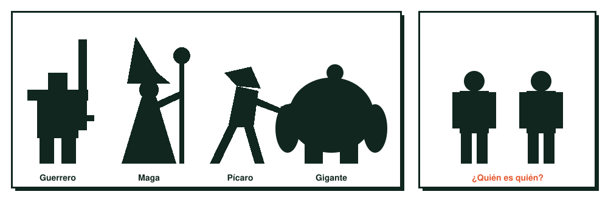
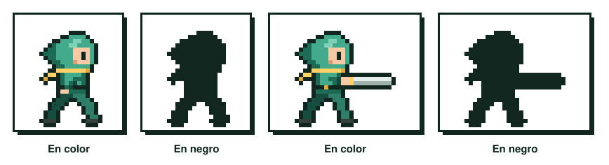

# Concept · La silueta

Haz la prueba con cualquier personaje famoso de videojuego: rellénalo de negro y quita todo lo demás. Si lo sigues reconociendo, tiene una buena silueta. En un juego el jugador ve a los personajes pequeños, en movimiento, de lejos, a contraluz o en mitad de una pelea con veinte cosas en pantalla. En esas condiciones los detalles desaparecen y lo único que queda es la forma.

Por eso la silueta es lo primero que se diseña y lo primero que se comprueba.

<figure markdown>

<figcaption>Solo con la forma sabes quién es cada personaje y qué hace. A la derecha, dos siluetas casi idénticas: sin detalle no hay manera de distinguirlas.</figcaption>
</figure>

## Qué tiene que contar una silueta

Una buena silueta responde a tres preguntas sin necesidad de color ni detalle: **quién** es el personaje, **cómo** es y **qué** hace. Un cuerpo ancho y cuadrado cuenta fuerza. Una figura estrecha, inclinada y con ropa larga cuenta algo muy distinto. Un objeto que sobresale (una espada enorme, un sombrero, una mochila) cuenta a qué se dedica.

Esto es especialmente importante en el diseño de juegos porque la silueta también transmite información de juego. Un enemigo tiene que distinguirse de un aliado de un vistazo; un enemigo peligroso, de uno débil. Si dos tipos de enemigo tienen la misma silueta, el jugador los confundirá en plena acción.

<figure markdown>

<figcaption>La prueba del negro con la mascota del curso: la pose y la espada se siguen leyendo sin color.</figcaption>
</figure>

Hay juegos que llevan esta idea al extremo. En *Limbo* (2010) casi todo lo que ves son siluetas negras sobre fondos grises, y aun así distingues perfectamente al protagonista, a la araña y cada elemento del escenario con el que puedes interactuar.

## Cómo diseñar desde la silueta

El método más eficaz es empezar directamente en negro. En lugar de dibujar líneas, pintas manchas de forma rellena con un pincel o una herramienta de lazo, muy rápido y a tamaño pequeño. Así no puedes esconder un problema de forma detrás de un buen detalle.

Haz muchas: una hoja entera con veinte o treinta variaciones del mismo personaje. Cambia proporciones, postura, accesorios y ropa. Después elige las que se leen mejor y trabaja sobre ellas; el color y el detalle se añaden encima de una forma que ya funciona.

Unos criterios para decidir cuál funciona:

- **Proporciones claras.** Tiene que haber contraste entre partes grandes y pequeñas; si todo es del mismo tamaño, la forma se vuelve aburrida.
- **Espacios negativos.** El hueco entre el brazo y el cuerpo, o entre las piernas, ayuda a entender la pose. Si los brazos se pegan al cuerpo, la silueta pierde información.
- **Un elemento característico.** Un rasgo que nadie más tenga en el juego: un peinado, un arma, una capa, una forma de cabeza.
- **Pose con intención.** Una pose neutra, de frente y con los brazos caídos, cuenta muy poco. Una pose con actitud cuenta mucho más.

## La silueta en cada unidad

En la **UT2** la silueta es crítica, porque a 32×32 píxeles es casi lo único que el jugador percibe; además, cada frame de una animación tiene que seguir leyéndose. En la **UT3** comprobarás la silueta de tus modelos desde varios ángulos y a distancia de cámara de juego. En la **UT4** la iluminación puede reforzarla con contraluces o destruirla si el personaje se funde con el fondo.
