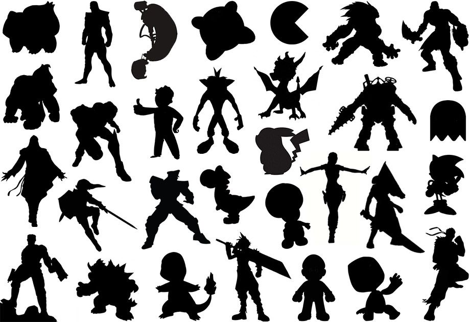
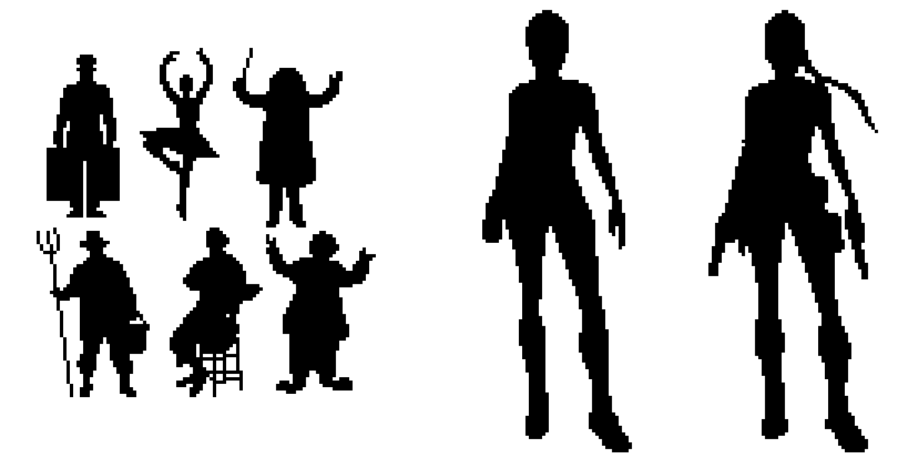
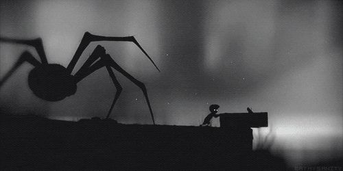

# Concept · La silueta

Haz la prueba con cualquier personaje famoso de videojuego: rellénalo de negro y quita todo lo demás. Si lo sigues reconociendo, tiene una **buena silueta**. En un juego el jugador ve a los personajes pequeños, en movimiento, de lejos, a contraluz o en mitad de una pelea con veinte cosas en pantalla. En esas condiciones los detalles desaparecen y **lo único que queda es la forma**.

Por eso **la silueta es lo primero que se diseña y lo primero que se comprueba**.

<figure markdown>
{ loading=lazy }
<figcaption>¿Cuántos reconoces? Ninguno tiene color, cara ni detalle, y aun así la mayoría se identifican al instante solo por su forma. Imagen: <a href="https://assets.anatomy4sculptors.com/2022/01/good-character-design-distinct-game-character-silhouette_1024x1024.jpg">Anatomy for Sculptors</a>. Personajes © de sus respectivos titulares; uso con fines educativos.</figcaption>
</figure>

## Qué tiene que contar una silueta

Una buena silueta responde a tres preguntas sin necesidad de color ni detalle: **quién** es el personaje, **cómo** es y **qué** hace. Un cuerpo ancho y cuadrado cuenta fuerza. Una figura estrecha, inclinada y con ropa larga cuenta algo muy distinto. Un objeto que sobresale (una espada enorme, un sombrero, una mochila) cuenta a qué se dedica.

<figure markdown>
{ loading=lazy }
<figcaption>A la izquierda, solo con la forma sabes quién es cada figura y qué está haciendo. A la derecha, dos siluetas casi iguales: la coleta y las fundas de las pistolas bastan para saber cuál es Lara Croft. Lara Croft (<i>Tomb Raider</i>) © Crystal Dynamics; resto de siluetas © de sus respectivos autores. Uso con fines educativos.</figcaption>
</figure>

Esto es especialmente importante en el diseño de juegos porque la silueta **también transmite información de juego**. Un enemigo tiene que distinguirse de un aliado de un vistazo; un enemigo peligroso, de uno débil. Si dos tipos de enemigo tienen la misma silueta, **el jugador los confundirá en plena acción**.

<figure>

<figcaption>Mario, Luigi, Wario y Waluigi llevan casi la misma ropa y aun así los distingues de un vistazo: la altura, la anchura y la postura de cada uno cuentan quién es. Imagen publicada en <a href="https://www.reddit.com/r/orks/comments/1jgh746/mario_luigi_wario_and_waluigi/">Reddit (r/orks)</a>. Personajes © Nintendo; uso con fines educativos.</figcaption>
</figure>

Hay juegos que llevan esta idea al extremo. En *Limbo* (2010) casi todo lo que ves son siluetas negras sobre fondos grises, y aun así distingues perfectamente al protagonista, a la araña y cada elemento del escenario con el que puedes interactuar.

<figure markdown>
{ loading=lazy }
<figcaption><i>Limbo</i> (Playdead, 2010). La araña y el niño se leen sin un solo detalle interior. Imagen © Playdead; uso con fines educativos.</figcaption>
</figure>

## Cómo diseñar desde la silueta

El método más eficaz es **empezar directamente en negro**. En lugar de dibujar líneas, pintas manchas de forma rellena con un pincel o una herramienta de lazo, muy rápido y a tamaño pequeño. Así **no puedes esconder un problema de forma detrás de un buen detalle**.

Haz muchas: una hoja entera con **veinte o treinta variaciones del mismo personaje**. Cambia proporciones, postura, accesorios y ropa. Después elige las que se leen mejor y trabaja sobre ellas; el color y el detalle se añaden **encima de una forma que ya funciona**.

Unos criterios para decidir cuál funciona:

- **Proporciones claras.** Tiene que haber contraste entre partes grandes y pequeñas; si todo es del mismo tamaño, la forma se vuelve aburrida.
- **Espacios negativos.** El hueco entre el brazo y el cuerpo, o entre las piernas, ayuda a entender la pose. Si los brazos se pegan al cuerpo, la silueta pierde información.
- **Un elemento característico.** Un rasgo que nadie más tenga en el juego: un peinado, un arma, una capa, una forma de cabeza.
- **Pose con intención.** Una pose neutra, de frente y con los brazos caídos, cuenta muy poco. Una pose con actitud cuenta mucho más.

## La silueta en cada unidad

En la **UT2** la silueta es crítica, porque a 32×32 píxeles es casi lo único que el jugador percibe; además, cada frame de una animación tiene que seguir leyéndose. En la **UT3** comprobarás la silueta de tus modelos desde varios ángulos y a distancia de cámara de juego. En la **UT4** la iluminación puede reforzarla con contraluces o destruirla si el personaje se funde con el fondo.
