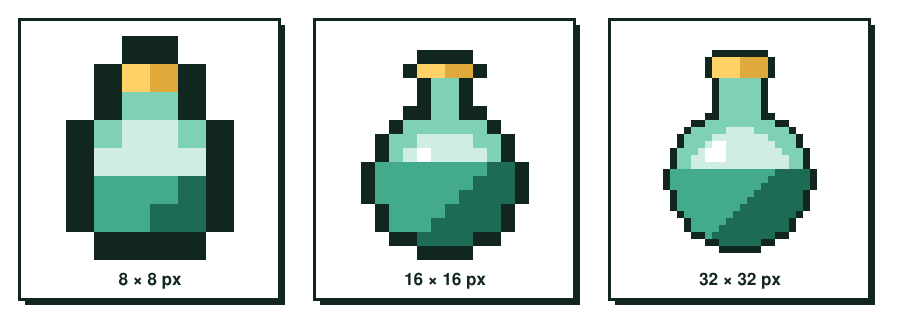
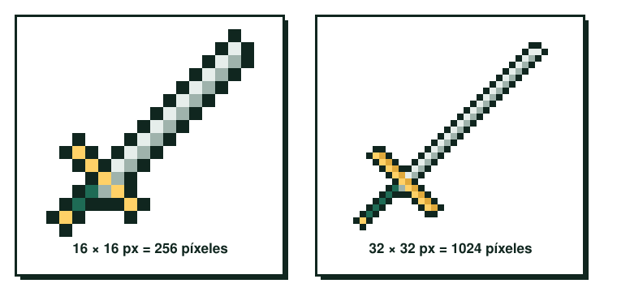
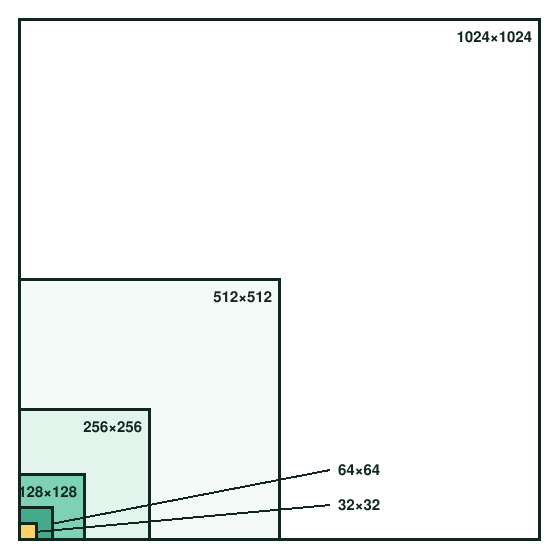

# UT2.3 Tamaño de la imagen

Lo primero que te pide un programa de pixel art al crear un archivo es el tamaño del lienzo, y es una decisión mucho más importante de lo que parece. En pixel art el tamaño no se cambia después: si dibujas un personaje a 16×16 y luego decides que lo querías a 32×32, no puedes estirarlo, tienes que volver a dibujarlo. El tamaño fija cuánto detalle cabe, cuánto trabajo te va a llevar y cómo encaja el asset con el resto del juego.

## Más píxeles, más detalle (y más trabajo)

Con pocos píxeles tienes que sintetizar: una cara son dos puntos para los ojos y poco más, y cada píxel tiene un peso enorme. Con más píxeles puedes dibujar pliegues de ropa, expresiones matizadas y sombreados complejos. Ningún extremo es mejor que el otro; son estilos distintos.

<figure markdown>

<figcaption>La misma poción a 8, 16 y 32 píxeles: cuanta más resolución, más detalle cabe.</figcaption>
</figure>

La contrapartida es el trabajo. Una espada de 16×16 tiene 256 píxeles; la misma espada a 32×32 tiene 1024, cuatro veces más. Y ese multiplicador se aplica a cada frame de cada animación. Por eso la regla práctica es clara: a más dimensión, más píxeles, y a más píxeles, más trabajo de pulido.

<figure markdown>

<figcaption>Duplicar el lado multiplica por cuatro el número de píxeles que tienes que resolver.</figcaption>
</figure>

## Dimensiones recomendadas

En videojuegos se trabaja casi siempre con dimensiones cuadradas que son potencias de dos: 16, 32, 64, 128, 256, 512 y 1024 píxeles de lado. Son los tamaños que mejor gestionan los motores (Unity, Godot) y las herramientas de empaquetado de texturas como TexturePacker. Verás por qué con más detalle en el apartado de [tiles y sprite sheets](04-tiles-y-sprite-sheets.md).

<figure markdown>

<figcaption>Las dimensiones más comunes para pixel art en videojuegos.</figcaption>
</figure>

| Tamaño del personaje | Qué permite | Juegos de referencia |
|---|---|---|
| 16×16 | Lectura muy sintética, animaciones rápidas de producir | Juegos de NES, *Celeste* (su mundo se construye con tiles de 8×8) |
| 32×32 | Expresión facial básica y equipamiento visible | *Stardew Valley*, muchos RPG de estilo 16 bits |
| 64×64 | Detalle de ropa, anatomía y sombreado | Juegos de lucha y acción con sprites grandes |
| 128×128 o más | Nivel de ilustración, animaciones muy costosas | *The Last Night*, arte pixel de alta resolución |

Fíjate en que *Celeste* y *The Last Night* son pixel art y aun así están en extremos opuestos. *Celeste* usa un personaje diminuto porque la lectura rápida en un plataformas exigente es lo más importante. *The Last Night* busca una atmósfera cinematográfica y trabaja con mucha más resolución y efectos de iluminación modernos.

## Cómo decidir tu tamaño

Hazte tres preguntas antes de crear el archivo. La primera es cómo se va a ver en pantalla: si el personaje ocupa poco espacio en un escenario grande, un tamaño pequeño basta. La segunda es cuántos frames vas a dibujar: multiplica mentalmente el trabajo de un frame por todas las animaciones que tienes que entregar. La tercera es qué tamaño tienen los tiles del mundo, porque el personaje tiene que encajar en esa rejilla (un personaje de 32×32 sobre tiles de 16×16 ocupa dos tiles de alto, por ejemplo).

Prueba siempre a tamaño real. Trabajar con el zoom al 800 % te engaña; lo que importa es cómo se ve al 100 % o al 200 %, que es como lo verá el jugador.
