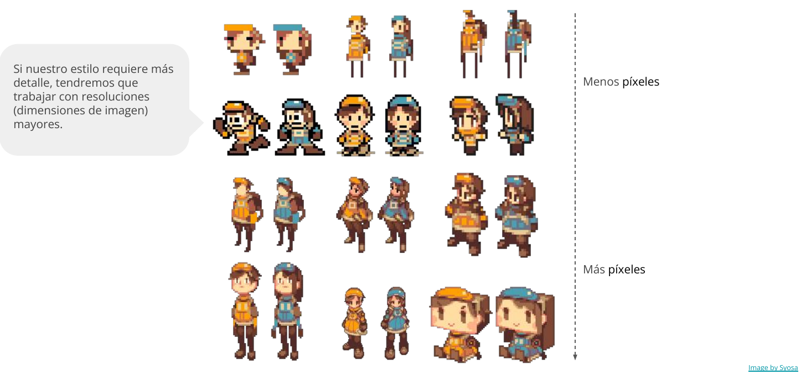
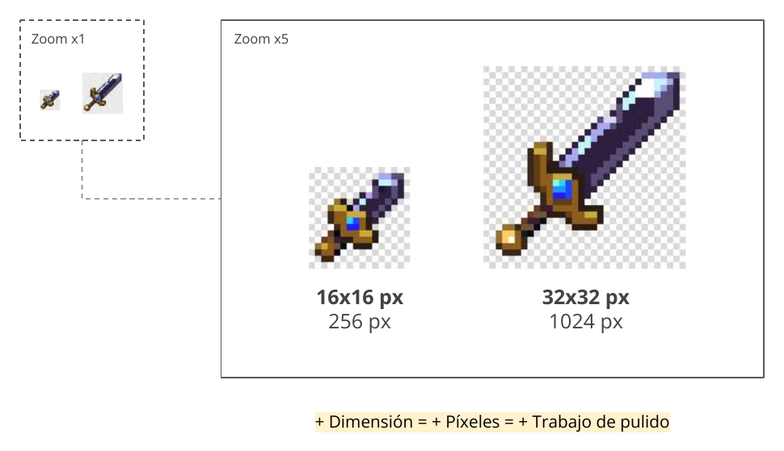
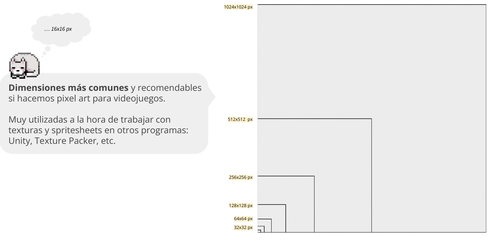

# UT2.3 Tamaño de la imagen

Lo primero que te pregunta un programa de pixel art al crear un archivo es el tamaño del lienzo. Parece un trámite, lo rellenas con lo primero que se te ocurre y a dibujar. Error.

En pixel art el tamaño no se cambia después. Si dibujas un personaje a 16×16 y a mitad de camino decides que lo querías a 32×32, no puedes estirarlo: toca volver a dibujarlo. Ese número decide cuánto detalle cabe, cuánto trabajo te va a llevar y cómo va a encajar el asset con el resto del juego.

## Más píxeles, más detalle (y más trabajo)

Con pocos píxeles tienes que sintetizar: una cara son dos puntos para los ojos y poco más, y cada píxel pesa muchísimo. Con más píxeles caben pliegues de ropa, expresiones con matices y sombreados complejos. ¿Cuál es mejor? Ninguno. Son estilos distintos, y cada juego pide el suyo.

<figure markdown>
{ loading=lazy }
<figcaption>El mismo tipo de personaje con más o menos píxeles: cuanta más resolución, más detalle cabe. Imagen de <a href="http://collet66.blog52.fc2.com/">Syosa</a>. Uso con fines educativos.</figcaption>
</figure>

Lo que sí hay que tener claro es la factura. Una espada de 16×16 tiene 256 píxeles; la misma espada a 32×32 tiene 1024, cuatro veces más. Y ahora multiplica eso por cada frame de cada animación. La regla práctica es sencilla: a más dimensión, más píxeles, y a más píxeles, más horas de pulido.

<figure markdown>
{ loading=lazy }
<figcaption>Duplicar el lado multiplica por cuatro el número de píxeles que tienes que resolver. Sprites © de sus respectivos autores. Uso con fines educativos.</figcaption>
</figure>

## Dimensiones recomendadas

En videojuegos se trabaja casi siempre con dimensiones cuadradas que son potencias de dos: 16, 32, 64, 128, 256, 512 y 1024 píxeles de lado. Son los tamaños que mejor gestionan los motores (Unity, Godot) y las herramientas de empaquetado de texturas como TexturePacker. Verás por qué con más detalle en el apartado de [tiles y sprite sheets](04-tiles-y-sprite-sheets.md).

<figure markdown>
{ loading=lazy }
<figcaption>Las dimensiones más comunes para pixel art en videojuegos. Uso con fines educativos.</figcaption>
</figure>

| Tamaño del personaje | Qué permite | Juegos de referencia |
|---|---|---|
| 16×16 | Lectura muy sintética, animaciones rápidas de producir | Juegos de NES, *Celeste* (su mundo se construye con tiles de 8×8) |
| 32×32 | Expresión facial básica y equipamiento visible | *Stardew Valley*, muchos RPG de estilo 16 bits |
| 64×64 | Detalle de ropa, anatomía y sombreado | Juegos de lucha y acción con sprites grandes |
| 128×128 o más | Nivel de ilustración, animaciones muy costosas | *The Last Night*, arte pixel de alta resolución |

Fíjate en que *Celeste* y *The Last Night* son pixel art y aun así están en extremos opuestos. *Celeste* usa un personaje diminuto porque la lectura rápida en un plataformas exigente es lo más importante. *The Last Night* busca una atmósfera cinematográfica y trabaja con mucha más resolución y efectos de iluminación modernos.

## Cómo decidir tu tamaño

Antes de crear el archivo, hazte tres preguntas. La primera es cómo se va a ver en pantalla: si el personaje ocupa poco espacio en un escenario grande, un tamaño pequeño basta. La segunda es cuántos frames vas a dibujar: multiplica mentalmente el trabajo de un frame por todas las animaciones que tienes que entregar. La tercera es qué tamaño tienen los tiles del mundo, porque el personaje tiene que encajar en esa rejilla (un personaje de 32×32 sobre tiles de 16×16 ocupa dos tiles de alto, por ejemplo).

Y un consejo que te va a salvar más de una vez: prueba siempre a tamaño real. Con el zoom al 800 % todo parece precioso, y es mentira. Lo que importa es cómo se ve al 100 % o al 200 %, que es como lo va a ver el jugador.
