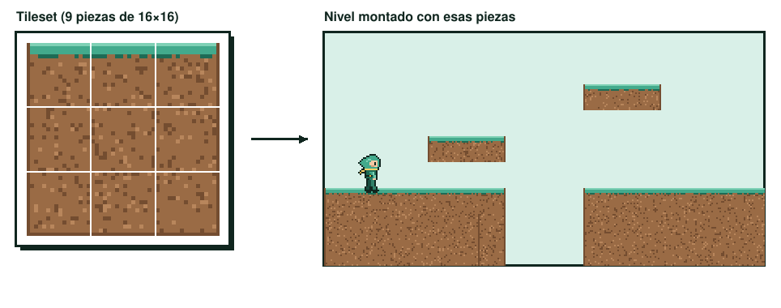
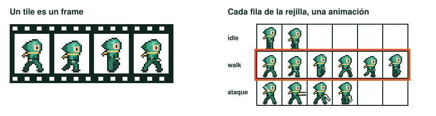
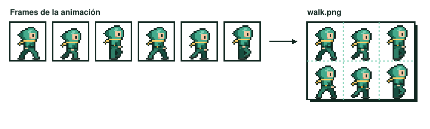
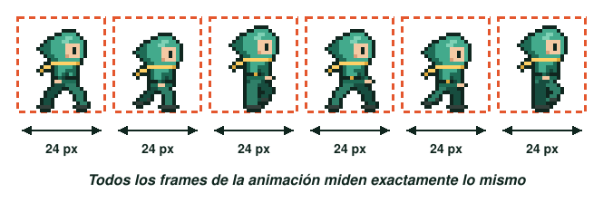
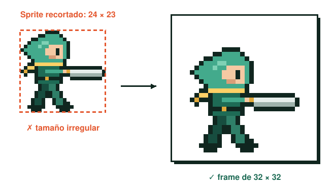

# UT2.4 Tiles y sprite sheets

Cuando abres Pyxel Edit por primera vez, lo que ves es una rejilla de casillas, y esa rejilla aparece por todas partes en el programa. Cada casilla es un tile, y entender para qué sirve es la base de casi todo lo que harás en esta unidad: con tiles construyes escenarios y con tiles construyes animaciones.

## Qué es un tile

Un tile es una celda de tamaño fijo dentro de una rejilla, y en ella se dibuja. Según lo que dibujes, ese tile servirá para una de dos cosas muy distintas: formar parte de un escenario o ser un fotograma de una animación.

## Tiles para crear tilesets

Un tileset es un documento donde dibujas piezas de escenario como si fueran las fichas de un puzle: suelo, pared, esquina, borde, un trozo de agua. Cada pieza ocupa una celda de la rejilla, un tile. Después, en el motor o en un editor de niveles, esas piezas se colocan una junto a otra para construir mapas completos.

<figure markdown>

<figcaption>Cada pieza del tileset ocupa un tile. Combinándolas se construye el escenario.</figcaption>
</figure>

La ventaja es enorme: con unas pocas decenas de tiles bien diseñados puedes construir niveles enormes, el juego ocupa menos memoria y modificar un nivel es tan fácil como mover piezas. La dificultad está en que los tiles tienen que encajar entre sí sin que se noten las costuras; lo verás con detalle en [escenarios 2D](09-escenarios-2d.md).

## Tiles para crear animaciones

En animación, un tile funciona igual que un fotograma (frame) en cine. Cada celda contiene una pose del personaje, y al reproducirlas seguidas y sin pausa se produce la ilusión de movimiento.

<figure markdown>

<figcaption>Tile = frame. Cada fila de la rejilla guarda una animación distinta del mismo personaje.</figcaption>
</figure>

Mientras trabajas, el programa te deja previsualizar esos frames en bucle, y puedes exportar el resultado como un GIF animado para enseñarlo. Para el motor del juego, en cambio, lo que se exporta es un sprite sheet.

## Qué es un sprite sheet

Un sprite sheet es una única imagen (normalmente un PNG con transparencia) que contiene todos los frames de una animación, o de varias, colocados en una rejilla. El motor carga esa imagen una sola vez y va mostrando cada trozo en orden. Es mucho más eficiente que cargar un archivo por frame.

<figure markdown>

<figcaption>Al exportar todos los frames de una animación obtienes un sprite sheet en PNG.</figcaption>
</figure>

Para que el motor pueda recortar el sprite sheet correctamente, todos los frames tienen que cumplir una condición: **tener exactamente el mismo tamaño**. Si un frame es más ancho porque el personaje extiende la espada, el tamaño de todos los frames tiene que crecer hasta ese ancho. El motor divide la imagen en celdas iguales y no sabe hacer otra cosa.

<figure markdown>

<figcaption>Todos los tiles o frames de una animación comparten el mismo tamaño.</figcaption>
</figure>

## Por qué potencias de dos

Las dimensiones más recomendadas para tiles y frames son potencias de dos: 16, 32, 64, 128, 256, 512, 1024. El motivo es técnico. Las tarjetas gráficas gestionan las texturas de forma más eficiente cuando sus dimensiones son potencias de dos, y los motores y herramientas de empaquetado (Unity, Godot, TexturePacker) están optimizados para esos tamaños. Además, las potencias de dos se dividen entre sí sin restos: un tile de 16 cabe exactamente dos veces en uno de 32, lo que hace que personajes y escenarios encajen en la misma rejilla.

¿Qué pasa si tu personaje ocupa 24×23 píxeles? En ese caso eliges la potencia de dos inmediatamente superior que lo contenga (aquí, 32×32) y colocas el personaje dentro dejando margen. Ese margen te hará falta cuando el personaje se mueva, extienda los brazos o blanda un arma.

<figure markdown>

<figcaption>Un sprite de 24×23 se coloca dentro de un frame de 32×32.</figcaption>
</figure>

Un consejo práctico: decide el tamaño del frame pensando en la pose más grande de todas las animaciones del personaje (normalmente el ataque) y usa ese tamaño para todas. Así todas sus animaciones comparten rejilla y el personaje no "salta" al cambiar de una a otra.

## Exportar para el motor

Al exportar un sprite sheet, comprueba siempre:

- Formato **PNG** con transparencia, nunca JPG (la compresión con pérdida destroza el pixel art).
- Todos los frames del **mismo tamaño**, sin separaciones irregulares entre ellos.
- El **punto de apoyo** (los pies del personaje) en la misma posición en todos los frames, para que no parezca que flota o se hunde.
- Un **nombre de archivo** que indique personaje, animación y tamaño de frame, por ejemplo `caballero_walk_64x64.png`.
