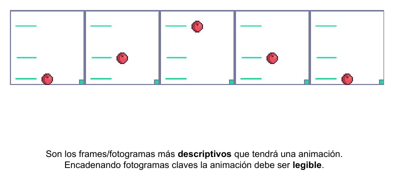
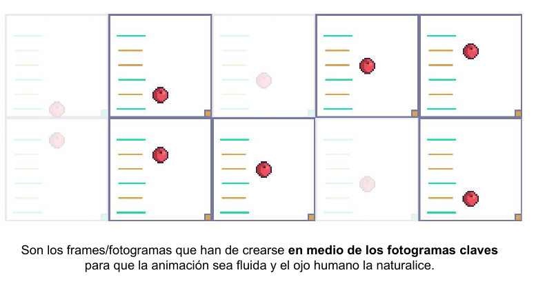
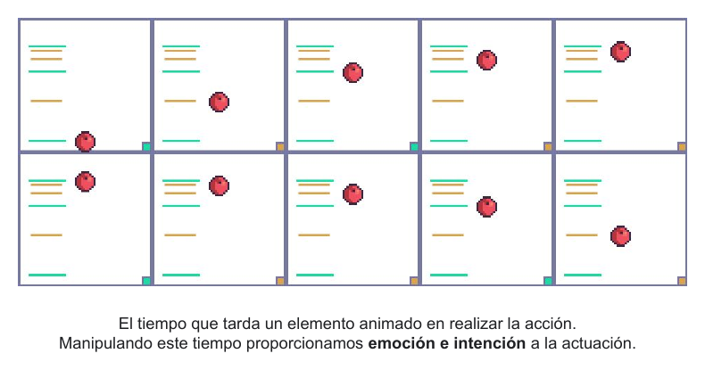
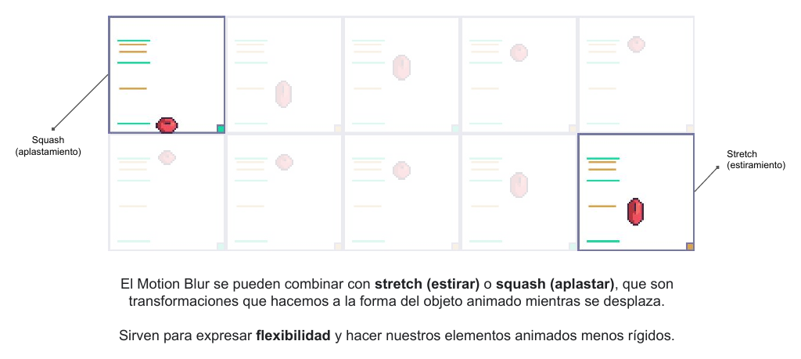

# UT2.5 Principios de animación

Una animación puede tener todos los frames bien dibujados y aun así parecer rígida, lenta o sin vida. Lo que hace que un movimiento resulte convincente depende menos del dibujo que de unas pocas decisiones sobre qué poses eliges, cuántos frames pones entre ellas y cuánto dura cada una. Los animadores de Disney recopilaron hace décadas doce principios de animación; en este apartado vas a ver los cuatro que más vas a usar en pixel art, construyendo paso a paso la animación más sencilla posible: una pelota que bota.

## Fotogramas clave

Los fotogramas clave (keyframes) son los frames más descriptivos de una animación, las poses que cuentan qué está pasando. En una pelota que bota son tres: arriba, abajo tocando el suelo y arriba otra vez. En un puñetazo, el brazo recogido y el brazo extendido.

La regla es que, encadenando solo los fotogramas clave, la animación ya tiene que entenderse. Si con las poses clave no se lee la acción, añadir frames intermedios no lo va a arreglar.

<figure markdown>

<figcaption>Solo con los fotogramas clave la acción ya se entiende, aunque todavía salta de golpe.</figcaption>
</figure>

Por eso siempre se empieza por aquí. Dibuja las poses clave, reprodúcelas y comprueba que la acción se entiende antes de seguir. Esas poses salen directamente de tu [hoja de poses](../concept/hojas-de-produccion.md#hojas-de-expresiones-y-de-poses) del concept.

## Interpolaciones

Las interpolaciones (inbetweens) son los frames que se dibujan entre dos fotogramas clave para que el ojo perciba el movimiento como continuo. Con solo las poses clave, la pelota aparece arriba y de repente abajo. Con interpolaciones, recorre el camino.

<figure markdown>

<figcaption>Las interpolaciones rellenan el camino entre poses clave y hacen que el movimiento sea fluido.</figcaption>
</figure>

¿Cuántas interpolaciones? Depende de la fluidez que quieras y del tiempo que tengas. Más frames dan un movimiento más suave, pero multiplican el trabajo, y en pixel art un movimiento con pocos frames bien elegidos suele resultar más expresivo que uno con muchos.

## Timing

El timing es el tiempo que tarda un elemento en realizar una acción, y es lo que le da peso, emoción e intención. La misma pelota, con el mismo dibujo, parece de goma o de plomo según cuánto tarde en caer y en subir.

El timing se controla de dos formas: con el número de frames y con la duración de cada frame. En pixel art es muy habitual no dar la misma duración a todos. Las poses importantes se mantienen más tiempo y los frames de transición pasan rápido.

<figure markdown>

<figcaption>Manipulando el tiempo proporcionas emoción e intención a la animación.</figcaption>
</figure>

En la pelota, fíjate en el espaciado: cerca de la parte alta los frames están muy juntos (la pelota frena, se queda casi quieta y empieza a caer) y cerca del suelo están muy separados (va rápida). Ese cambio de espaciado es lo que el ojo interpreta como gravedad.

## Squash, stretch y motion blur

El **squash** (aplastamiento) y el **stretch** (estiramiento) son deformaciones que aplicas a la forma de un objeto mientras se mueve. La pelota se estira cuando cae deprisa y se aplasta al chocar con el suelo. Sirven para expresar flexibilidad, velocidad e impacto, y hacen que los elementos animados dejen de parecer rígidos.

La regla que no puedes saltarte es que el volumen se conserva: si la pelota se aplasta verticalmente, se ensancha horizontalmente. Si solo la achatas, parecerá que encoge.

<figure markdown>

<figcaption>Squash al impactar y stretch en la caída. Son frames que por separado parecen "raros", y es lo normal.</figcaption>
</figure>

El **motion blur** (desenfoque de movimiento) es el efecto que representa un objeto que se mueve tan deprisa que deja un rastro. En pixel art se dibuja a mano: una estela, una forma alargada o varias copias superpuestas del objeto. Se usa en movimientos bruscos o veloces, como un golpe de espada, y combinado con stretch resulta muy eficaz.

Estos frames, vistos sueltos, parecen dibujos mal hechos. Reproducidos a velocidad son los que dan vida a la animación. La animación clásica está llena de ellos: si pausas cualquier película de animación en mitad de un movimiento rápido encontrarás personajes deformados de formas imposibles.

| Principio | Qué controla | Pregunta para comprobarlo |
|---|---|---|
| Fotogramas clave | Qué pasa | ¿Se entiende la acción solo con las poses clave? |
| Interpolaciones | Fluidez | ¿El movimiento es continuo o salta? |
| Timing | Peso e intención | ¿Pesa lo que tiene que pesar? |
| Squash, stretch y motion blur | Flexibilidad, velocidad e impacto | ¿Se siente la velocidad y el golpe? |

## Lo que te llevas

Una animación se construye de fuera hacia dentro: primero los fotogramas clave que cuentan la acción, después las interpolaciones y el timing que le dan peso, y por último las deformaciones que le dan vida. Si las poses clave no funcionan, nada de lo que añadas después lo arreglará.
