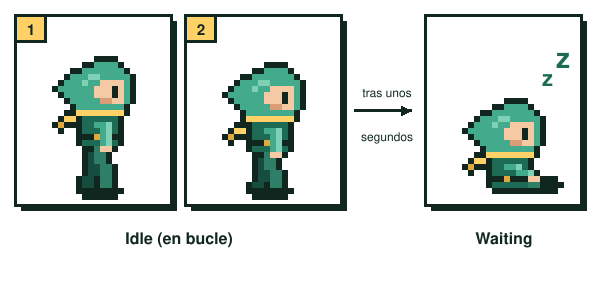

# UT2.6 Animación de espera

Suelta el mando en mitad de una partida. El personaje sigue ahí, respirando, balanceándose, parpadeando. Y si tardas un rato en volver, a lo mejor se sienta, mira el reloj o se pone a jugar con su arma. Esa animación, que parece un detalle menor, es la que más veces va a ver el jugador en todo el juego, porque el personaje pasa mucho tiempo quieto.

## Qué es y para qué sirve

La animación de espera es la que reproduce un personaje cuando el jugador no lo está moviendo. Su función es informar de que el personaje sigue vivo y activo, a la espera de que vuelvas a coger el mando. Un personaje completamente estático parece un error o un juego colgado.

Se divide en dos estados que se suceden en el tiempo: **idle** (parada) y **waiting** (espera).

<figure markdown>

<figcaption>Primero el idle, en bucle. Si el jugador tarda, el waiting.</figcaption>
</figure>

## Idle: la animación de parada

El idle es normalmente una respiración exagerada, sin que el personaje se mueva del sitio. El pecho sube y baja, los hombros acompañan y, muchas veces, todo el cuerpo da un pequeño bote.

Es la animación más sencilla de hacer y la mejor para empezar, porque trabaja con muy pocos cambios. Unas pautas:

- **Pocos frames.** Entre dos y seis suelen bastar. Muchos juegos clásicos resuelven el idle con dos.
- **Cambios mínimos.** A menudo basta con bajar uno o dos píxeles la cabeza y el torso y dejar las piernas quietas. Si mueves todo, parecerá que el personaje baila.
- **Bucle perfecto.** El último frame tiene que enlazar con el primero sin salto, porque esta animación se repite indefinidamente.
- **Timing tranquilo.** Una respiración es lenta. Da más duración a los frames de los extremos (pecho arriba, pecho abajo).

El idle también transmite personalidad y estado. Un guerrero en guardia respira con la espada preparada; un personaje cansado deja caer los hombros; uno nervioso se balancea más rápido. Mira tu hoja de poses del concept y decide cuál es la actitud por defecto de tu personaje.

## Waiting: la animación de espera

El waiting se reproduce después del idle, cuando el jugador lleva un rato sin tocar nada. En esta animación el personaje cambia de postura o de gesto, generalmente para decirte que estás tardando en volver a jugar.

No tiene por qué ser un gesto de impaciencia. Hay miles de posibilidades: sentarse, bostezar, sacar un libro, hacer malabares con una piedra, mirar a la cámara. Es una de las mejores oportunidades que tienes para aportar personalidad, porque no está condicionada por ninguna mecánica del juego y puedes contar algo del personaje.

Técnicamente suele tener tres partes: una transición desde el idle, la acción de espera (que puede estar en bucle) y, a veces, una transición de vuelta. Cuando el jugador toca un control, el juego corta el waiting y pasa a la animación que corresponda.

| Estado | Cuándo se reproduce | Duración típica | Qué comunica |
|---|---|---|---|
| Idle | En cuanto el personaje deja de moverse, en bucle | 2 a 6 frames | Que está vivo y listo |
| Waiting | Tras unos segundos de inactividad | Más larga y variable | Personalidad; que el jugador se ha ido |
