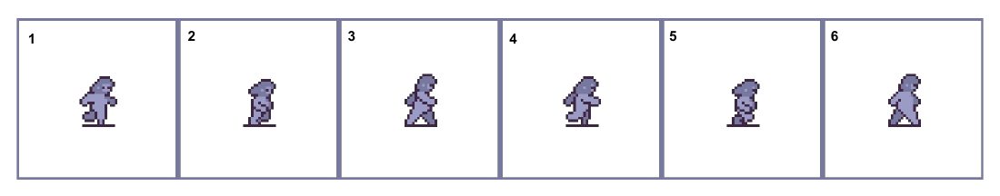
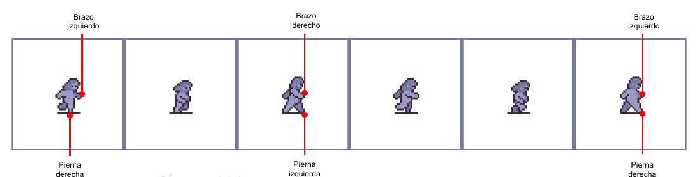
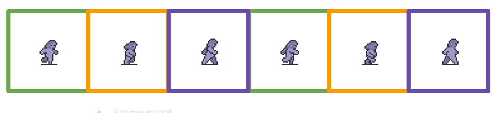
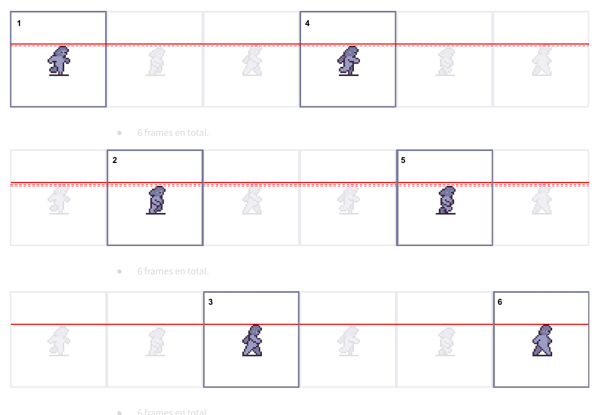

# UT2.7 Walking cycle

Andar es tan natural que nunca te has parado a pensar cómo lo haces. En cuanto intentas animarlo descubres que es un movimiento bastante complejo: las piernas se alternan, los brazos se mueven al revés que ellas, el cuerpo sube y baja y todo tiene que repetirse sin que se note el corte. La buena noticia es que en pixel art existe una receta sencilla que funciona, y a partir de ella puedes añadir toda la personalidad que quieras.

## Qué es un walking cycle

El walking cycle (ciclo de andar) es la animación que reproduce un personaje cuando se desplaza andando. Es un ciclo porque se repite en bucle: el último frame enlaza con el primero. Muchos personajes también tienen un running cycle (ciclo de correr), que sigue la misma lógica con poses más extremas y un timing más rápido.

Un detalle importante: en la mayoría de juegos 2D el personaje anda "en el sitio" dentro de su frame, y es el motor el que lo desplaza por el escenario. Tu trabajo es que el movimiento de las piernas parezca coherente con esa velocidad de desplazamiento; si no lo es, el personaje parecerá que patina.

## Cuántos frames

Hay walking cycles de 2, 3, 6, 12, 24 frames o más. Todo depende de la fluidez que quieras y del tiempo que tengas. Dos frames dan un andar muy retro, casi de máquina recreativa; doce o más dan un movimiento suave, casi de animación tradicional.

El número de frames no es lo único que importa. El ciclo es una gran oportunidad para dar personalidad al personaje y para comunicar su peso y su velocidad: un gigante pesado apoya con fuerza y se hunde en cada paso, un personaje ligero apenas toca el suelo, uno sigiloso anda encogido. Antes de animar, revisa tu [hoja de poses](../concept/hojas-de-produccion.md#hojas-de-expresiones-y-de-poses) y decide cómo anda tu personaje.

## La receta de 6 frames

Seis frames es un buen punto de partida: es suficiente para que el movimiento se lea con claridad y asumible de producir. Esta es la receta.

<figure markdown>

<figcaption>La base: 6 frames en total.</figcaption>
</figure>

**Las piernas.** Durante los frames 1, 2 y 3, una pierna está apoyada en el suelo y se desplaza hacia atrás, empujando el cuerpo hacia delante. Durante los frames 4, 5 y 6 ocurre exactamente lo mismo con la otra pierna. Así, el ciclo se divide en dos mitades simétricas.

**Los brazos.** Los brazos siempre avanzan junto a la pierna contraria. Cuando la pierna derecha va delante, el brazo izquierdo va delante, y al revés. Es lo que hacemos al andar para mantener el equilibrio, y si lo inviertes el personaje parece un robot.

<figure markdown>

<figcaption>Brazo izquierdo con pierna derecha, brazo derecho con pierna izquierda.</figcaption>
</figure>

**Copiar y modificar.** Como las dos mitades son simétricas, no tienes que dibujar seis poses distintas desde cero. El frame 4 parte del frame 1, el 5 del 2 y el 6 del 3: copias el frame y cambias qué pierna y qué brazo van delante.

<figure markdown>

<figcaption>Los frames del mismo color son equivalentes: se copian y se intercambian las extremidades.</figcaption>
</figure>

**La altura.** Aquí está el detalle que hace que el ciclo parezca vivo. Al andar, el cuerpo sube y baja: está más bajo justo después de apoyar el pie, cuando carga el peso, y más alto cuando la pierna libre pasa junto a la de apoyo. En la receta de 6 frames:

- En los frames **3 y 6** el personaje alcanza su altura máxima.
- En los frames **1 y 4** reduce **1 píxel** su altura máxima.
- En los frames **2 y 5** reduce **2 píxeles** su altura máxima.

<figure markdown>

<figcaption>De arriba abajo: frames 1 y 4 (1 píxel más bajo), 2 y 5 (2 píxeles más bajo), 3 y 6 (altura máxima).</figcaption>
</figure>

Uno o dos píxeles parecen nada, pero a escala de sprite es exactamente lo que el ojo necesita para percibir el peso del cuerpo. Sin esa variación, el personaje se desliza por el escenario como si fuera sobre raíles.

| Frames | Momento del paso | Altura |
|---|---|---|
| 1 y 4 | Contacto: el pie toca el suelo por delante | 1 píxel por debajo del máximo |
| 2 y 5 | Recepción: el cuerpo carga el peso | 2 píxeles por debajo del máximo |
| 3 y 6 | Paso: la pierna libre pasa junto a la de apoyo | Altura máxima |

## Comprobar el ciclo

Reproduce la animación en bucle y fíjate en tres cosas. Que no haya un salto visible entre el frame 6 y el 1. Que los pies no parezcan resbalar cuando están apoyados. Y que el personaje mantenga su volumen en todos los frames: un brazo que crece o una cabeza que cambia de forma se notan muchísimo en bucle.

## Lo que te llevas

Un walking cycle de 6 frames se construye con dos mitades simétricas, con los brazos siempre opuestos a las piernas y con una variación de uno o dos píxeles de altura que da peso al cuerpo. A partir de esa receta, la personalidad del personaje se añade en la postura, el ritmo y la forma de apoyar.
