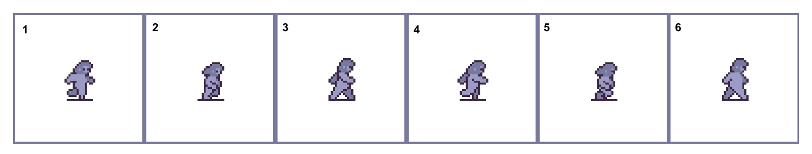
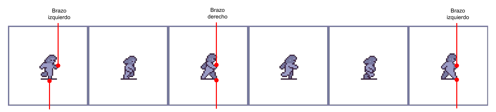
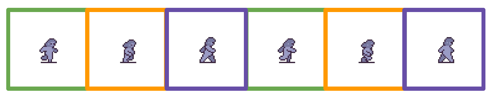
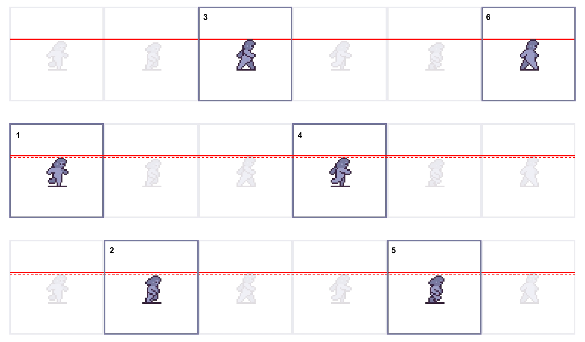

# UT2.7 Walking cycle

Andas todos los días y seguro que nunca te has parado a pensar cómo lo haces. Hasta que intentas animarlo. Ahí descubres que andar es un lío: las piernas se alternan, los brazos van al revés que ellas, el cuerpo sube y baja y todo tiene que repetirse sin que se note el corte.

Tranquilidad. En pixel art hay una receta sencilla que funciona, y a partir de ella puedes añadirle a tu personaje toda la personalidad que quieras.

## Qué es un walking cycle

El walking cycle (ciclo de andar) es la animación que reproduce un personaje cuando se desplaza andando. Es un ciclo porque se repite en bucle: el último frame enlaza con el primero. Muchos personajes también tienen un running cycle (ciclo de correr), que sigue la misma lógica con poses más extremas y un timing más rápido.

Un detalle importante: en la mayoría de juegos 2D el personaje anda "en el sitio" dentro de su frame, y es el motor el que lo desplaza por el escenario. Tu trabajo es que el movimiento de las piernas cuadre con esa velocidad; si no cuadra, el personaje parecerá que va sobre patines.

## Cuántos frames

Hay walking cycles de 2, 3, 6, 12, 24 frames o más. Todo depende de la fluidez que quieras y del tiempo que tengas. Dos frames dan un andar muy retro, de máquina recreativa de bar; doce o más dan un movimiento suave, casi de película de animación.

El número de frames no es lo único que importa. El ciclo es una gran oportunidad para dar personalidad al personaje y para comunicar su peso y su velocidad: un gigante pesado apoya con fuerza y se hunde en cada paso, un personaje ligero apenas toca el suelo, uno sigiloso anda encogido. Antes de animar, revisa tu [hoja de poses](../concept/hojas-de-produccion.md#hojas-de-expresiones-y-de-poses) y decide cómo anda tu personaje.

## La receta de 6 frames

Seis frames es un buen punto de partida: suficientes para que el movimiento se lea claro y pocos para que puedas producirlos sin morir en el intento. Esta es la receta.

<figure markdown>
{ loading=lazy }
<figcaption>La base: 6 frames en total. Sprites © de sus respectivos autores. Uso con fines educativos.</figcaption>
</figure>

**Las piernas.** Durante los frames 1, 2 y 3, una pierna está apoyada en el suelo y se desplaza hacia atrás, empujando el cuerpo hacia delante. Durante los frames 4, 5 y 6 ocurre exactamente lo mismo con la otra pierna. Así, el ciclo se divide en dos mitades simétricas.

**Los brazos.** Los brazos siempre avanzan junto a la pierna contraria. Cuando la pierna derecha va delante, el brazo izquierdo va delante, y al revés. Es lo que haces tú al andar para mantener el equilibrio (compruébalo por el pasillo). Si lo inviertes, el personaje parece un robot.

<figure markdown>
{ loading=lazy }
<figcaption>Frames 1 y 4: cuando la pierna cercana va delante, el brazo cercano va detrás, y al revés. Sprites © de sus respectivos autores. Uso con fines educativos.</figcaption>
</figure>

**Copiar y modificar.** Aquí viene la parte buena: como las dos mitades son simétricas, no tienes que dibujar seis poses desde cero. El frame 4 parte del frame 1, el 5 del 2 y el 6 del 3: copias el frame y cambias qué pierna y qué brazo van delante.

<figure markdown>
{ loading=lazy }
<figcaption>Los frames del mismo color son equivalentes (1 y 4, 2 y 5, 3 y 6): se copian y se intercambian las extremidades. Sprites © de sus respectivos autores. Uso con fines educativos.</figcaption>
</figure>

**La altura.** Aquí está el detalle que hace que el ciclo parezca vivo. Al andar, el cuerpo sube y baja: está más bajo justo después de apoyar el pie, cuando carga el peso, y más alto cuando la pierna libre pasa junto a la de apoyo. En la receta de 6 frames:

- En los frames **3 y 6** el personaje alcanza su altura máxima.
- En los frames **1 y 4** reduce **1 píxel** su altura máxima.
- En los frames **2 y 5** reduce **2 píxeles** su altura máxima.

<figure markdown>
{ loading=lazy }
<figcaption>La línea discontinua marca la altura máxima: los frames 3 y 6 la tocan, el 1 y el 4 quedan 1 píxel por debajo y el 2 y el 5, 2 píxeles. Sprites © de sus respectivos autores. Uso con fines educativos.</figcaption>
</figure>

Uno o dos píxeles parecen una tontería. A escala de sprite, son exactamente lo que el ojo necesita para sentir el peso del cuerpo. Quítalos y el personaje se desliza por el escenario como si fuera sobre raíles.

| Frames | Momento del paso | Altura |
|---|---|---|
| 1 y 4 | Contacto: el pie toca el suelo por delante | 1 píxel por debajo del máximo |
| 2 y 5 | Recepción: el cuerpo carga el peso | 2 píxeles por debajo del máximo |
| 3 y 6 | Paso: la pierna libre pasa junto a la de apoyo | Altura máxima |

## Comprobar el ciclo

Reproduce la animación en bucle, déjala correr un rato y fíjate en tres cosas. Que no haya un salto visible entre el frame 6 y el 1. Que los pies no parezcan resbalar cuando están apoyados. Y que el personaje mantenga su volumen en todos los frames: un brazo que crece o una cabeza que cambia de forma se notan muchísimo en bucle.
