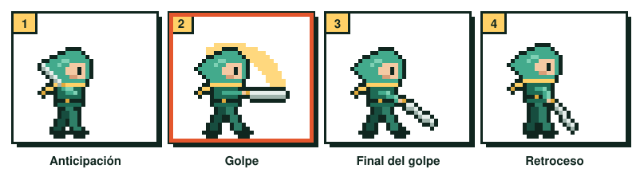
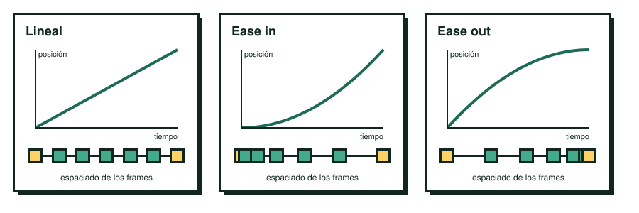
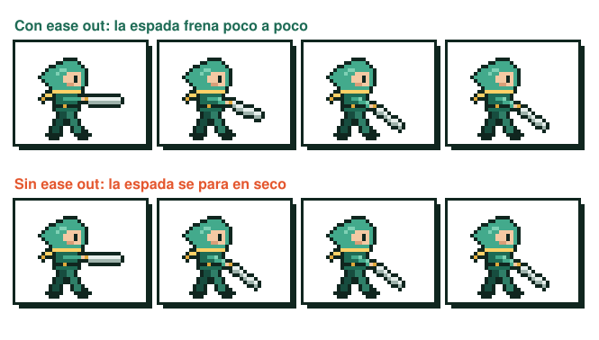

# UT2.8 Animación de ataque

El ataque es la animación en la que más se nota si un juego se siente bien o mal. Cuando pulsas el botón esperas una respuesta inmediata, y cuando el golpe impacta quieres sentirlo. Si el ataque tarda en salir, parece que el control no responde; si no tiene fuerza, el combate resulta blando. Todo eso se decide en muy pocos frames.

## Qué es

La animación de ataque es la que permite al jugador atacar con su personaje. Suele hacer uso de sus armas (cuchillos, espadas, pistolas, bates, hachas) o simplemente de sus puños. Hay infinitos ataques posibles, y el límite está en tu imaginación y en lo que tu personaje es: el ataque de un mago y el de un bárbaro no tienen nada que ver.

## Los cuatro estados de un ataque

Un ataque se puede dividir en estados, que son momentos diferentes dentro de una misma acción: **anticipación**, **golpe**, **final del golpe** y **retroceso**. En pixel art cada estado suele ser uno o dos frames, así que puedes tomarlos directamente como fotogramas clave.

<figure markdown>

<figcaption>Los cuatro estados de la animación de ataque. El golpe es el más importante.</figcaption>
</figure>

### Anticipación

Es la preparación: el personaje recoge el brazo o echa el arma hacia atrás antes de golpear. La anticipación le dice al ojo que algo va a pasar y hace que el golpe posterior parezca más fuerte.

En el personaje del jugador tienes que usarla con cuidado. Puede no existir, y como máximo debería durar un frame, porque cada frame de anticipación es tiempo en el que el jugador ha pulsado el botón y todavía no ha pasado nada: más de uno se percibe como retardo en el control.

En los **enemigos** es al revés. Ahí interesa una anticipación larga y clara, de varios frames, porque es la señal que avisa al jugador de que viene un ataque y le da tiempo a esquivarlo. Buena parte de la dificultad justa de un juego de acción está en esas anticipaciones.

### Golpe

Es el frame más importante del ataque, el momento del impacto. Tiene que ser rápido, uno o dos frames, y es donde se concentra la fuerza del movimiento. La estela que acompaña al arma es el efecto de [motion blur](05-principios-de-animacion.md#squash-stretch-y-motion-blur) que viste en los principios de animación: dibujas el recorrido del arma como una forma alargada, a veces combinada con un stretch del cuerpo.

### Final del golpe

Es el frame con la pose en la que termina el movimiento. Suele parecerse a la pose del golpe, pero sin el efecto de desenfoque: el arma ya ha llegado al final de su recorrido y el cuerpo está extendido.

### Retroceso

Puede no existir. Su función es suavizar la vuelta a otra animación distinta (andar, saltar, esperar). Es un frame con una pose intermedia entre la del ataque y la pose de espera del personaje, para que el cambio no sea brusco.

| Estado | Frames | Clave |
|---|---|---|
| Anticipación | 0 o 1 en el jugador; varios en enemigos | Más frames = más retardo en el control |
| Golpe | 1 o 2 | El frame más importante; lleva motion blur |
| Final del golpe | 1 | Pose final, sin desenfoque |
| Retroceso | 0 o 1 | Transición hacia la siguiente animación |

## Easing: suavidad al principio y al final

El easing controla cómo acelera y frena un movimiento. En la vida real nada arranca ni se detiene de golpe: los objetos aceleran al empezar a moverse y frenan antes de pararse.

El **ease in** (suavidad al principio) hace que el movimiento arranque despacio y vaya acelerando. El **ease out** (suavidad al final) hace que llegue rápido y frene poco a poco. El **ease in-out** combina los dos. En la práctica se consigue con el espaciado entre frames: frames muy juntos donde el movimiento es lento y muy separados donde es rápido, igual que la pelota que viste en el [timing](05-principios-de-animacion.md#timing).

<figure markdown>

<figcaption>Ease in: suavidad al principio. Ease out: suavidad al final.</figcaption>
</figure>

En un ataque, el golpe tiene que ser instantáneo, así que no lleva ease in. Donde el easing marca la diferencia es después del impacto. Con **ease out**, el arma frena en dos o tres frames y el golpe resulta pesado y contundente. Sin él, el arma se detiene en seco y el movimiento parece mecánico.

<figure markdown>

<figcaption>A la izquierda, el golpe con ease out; a la derecha, sin él.</figcaption>
</figure>
